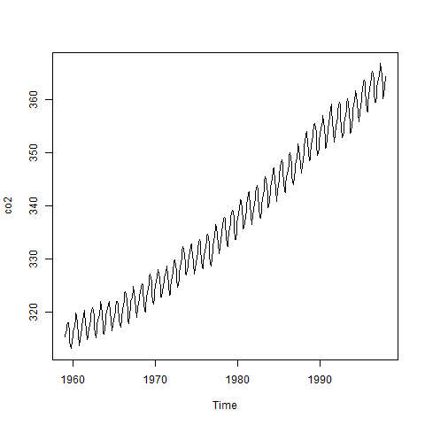

```{r setup, echo=FALSE}
knitr::opts_chunk$set(echo=FALSE)
```

### Introduction

* Keep things simple
  + Evenly spaced
  + No gaps
  + Single series
* Topics covered
  + Structure
  + Plotting
  + Detrending and deseasonalizing
  + Basic Box-Jenkins models
  
### White noise

```{r white-noise}
set.seed(23571113)
plot(rnorm(100), type="l")
```

### Correlation matrix

\[
 \begin{matrix}
  1 & 0 & 0 & 0 & \cdots & 0 & 0 \\
  0 & 1 & 0 & 0 & \cdots & 0 & 0 \\
  0 & 0 & 1 & 0 & \cdots & 0 & 0 \\
  0 & 0 & 0 & 1 & \cdots & 0 & 0 \\
  \vdots & \vdots & \vdots & \vdots & \ddots & \vdots & \vdots \\
  0 & 0 & 0 & 0 & \cdots & 1 & 0 \\ 
  0 & 0 & 0 & 0 & \cdots & 0 & 1 
 \end{matrix}
\]


### Structure

The base R package has an object class, ts. You can specify three parameters: start, stop, and frequency. You do not need to place your data in a ts object before running time series analyses. 

There is a new class, tsibble, that I have not had a chance to work with. It is based on the principles of tidy data. Read the [tsibble vignette](https://cran.rstudio.com/web/packages/tsibble/vignettes/intro-tsibble.html) for more information.

### Structure of co2 data

```{r co2, echo=TRUE}
str(co2)
attributes(co2)
```

### Plot of co2 data

```{r co2-plot}
fn <- "../images/co2_1.png"
png(fn)
plot(co2)
# storing the results in tmp prevents
# printing a stray message on your slides.
tmp <- dev.off()
```



### Decomposition of co2

```{r co2-decomp, echo=TRUE}
co2_d <- decompose(co2)
str(co2_d)
```

### Plot of co2 decomposition

```{r co2-decomp-plot}
plot(co2_d)
```

### UKgas

```{r UKgas, echo=TRUE}
str(UKgas)
attributes(UKgas)
```

### Plot UKGas

```{r UKgas-plot}
plot(UKgas)
```

### UKgas decomposition

```{r UKgas-decomp, echo=TRUE}
UKgas_d <- decompose(UKgas, type="multiplicative")
str(UKgas_d)
```

### Plot of UKgas decomposition

```{r UKgas-decomp-plot}
plot(UKgas_d)
```

### Autoregressive

$Z_t=\phi Z_{t-1} + \epsilon_t$

$Z_t=\phi^2 Z_{t-2}+\phi \epsilon_{t-1} + \epsilon_t$

$Z_t=\phi^3 Z_{t-3}  + \phi^2 \epsilon_{t-2} + \phi \epsilon_{t-1} + \epsilon_t$

### Correlation matrix

\[
 \begin{matrix}
  1 & \phi & \phi^2 & \phi^3 & \cdots & \phi^{n-2} & \phi^{n-1} \\
  \phi & 1 & \phi & \phi^2 & \cdots & \phi^{n-3} & \phi^{n-2} \\
  \phi^2 & \phi & 1 & \phi & \cdots & \phi^{n-4} & \phi^{n-3} \\
  \phi^3 & \phi^2 & \phi & 1 & \cdots & \phi^{n-5} & \phi^{n-4} \\
  \vdots & \vdots & \vdots & \vdots & \ddots & \vdots & \vdots \\
  \phi^{n-2} & \phi^{n-3} & \phi^{n-4} & \phi^{n-5} & \cdots & 1 & \phi \\ 
  \phi^{n-1} & \phi^{n-2} & \phi^{n-3} & \phi^{n-4} & \cdots & \phi
& 1 
 \end{matrix}
\]

### Positive autocorrelation

```{r pos}
set.seed(23571113)
x <- arima.sim(n = 100, list(ar=0.8, ma=0))
attributes(x) <- NULL
plot(x)
```

### Lag plot

```{r diff-pos, fig.width=5, fig.height=5}
lag.plot(x, pty="s", do.lines=FALSE, labels=FALSE)
```

### Negative autocorrelation

```{r neg}
set.seed(23571113)
x <- arima.sim(n = 100, list(ar=-0.8, ma=0))
plot(x)
```

### Lag plot

```{r diff-neg, fig.width=5, fig.height=5}
lag.plot(x, pty="s", do.lines=FALSE, labels=FALSE)
```

### Lag plot

```{r lag2, fig.width=5, fig.height=5}
lag.plot(x, pty="s", do.lines=FALSE, labels=FALSE, set.lags=2)
```

### acf and pacf for co2 data

```{r co2-auto}
par(mfrow=c(1, 2))
acf(co2_d$random, na.action=na.omit)
pacf(co2_d$random, na.action=na.omit)
```

### Structure of LakeHuron data

```{r LakeHuron, echo=TRUE}
str(LakeHuron)
attributes(LakeHuron)
```

### Plot of LakeHuron data

```{r LakeHuron-plot}
plot(LakeHuron)
```

### acf and pacf for data

```{r LakeHuron-auto}
par(mfrow=c(1, 2))
acf(LakeHuron, na.action=na.omit)
pacf(LakeHuron, na.action=na.omit)
```

### Structure of mdeaths data

```{r mdeaths, echo=TRUE}
str(mdeaths)
attributes(mdeaths)
```

### Plot of mdeaths

```{r mdeaths-plot}
plot(mdeaths)
```

### Structure of Nile data

```{r Nile, echo=TRUE}
str(Nile)
attributes(Nile)
```

### Plot of Nile data

```{r Nile-plot}
plot(Nile)
```

### Structure of nottem

```{r nottem, echo=TRUE}
str(nottem)
attributes(nottem)
```

### Plot of nottem

```{r nottem-plot}
plot(nottem)
```

### Structure of sunspot.year

```{r sunspot, echo=TRUE}
str(sunspot.year)
attributes(sunspot.year)
```

### Plot of sunspot.year

```{r sunspot-plot}
plot(sunspot.year)
```

### Structure of treering

```{r treering, echo=TRUE}
str(treering)
attributes(treering)
```

### Plot of treering

```{r treering-plot}
plot(treering)
```

### UKDriverDeaths

```{r UK, echo=TRUE}
str(UKDriverDeaths)
attributes(UKDriverDeaths)
```

### Plot UKDriver Deaths

```{r UKDriverDeaths-plot}
plot(UKDriverDeaths)
```

### USAccDeaths

```{r US, echo=TRUE}
str(USAccDeaths)
attributes(USAccDeaths)
```

### USAccDeaths plot

```{r USAccDeaths-plot, echo=FALSE}
plot(USAccDeaths)
```

### arima.sim

```{r arima.sim}
plot(arima.sim(n = 63, list(ar = c(0.8897, -0.4858), ma = c(-0.2279, 0.2488)),
          sd = sqrt(0.1796)))
```

